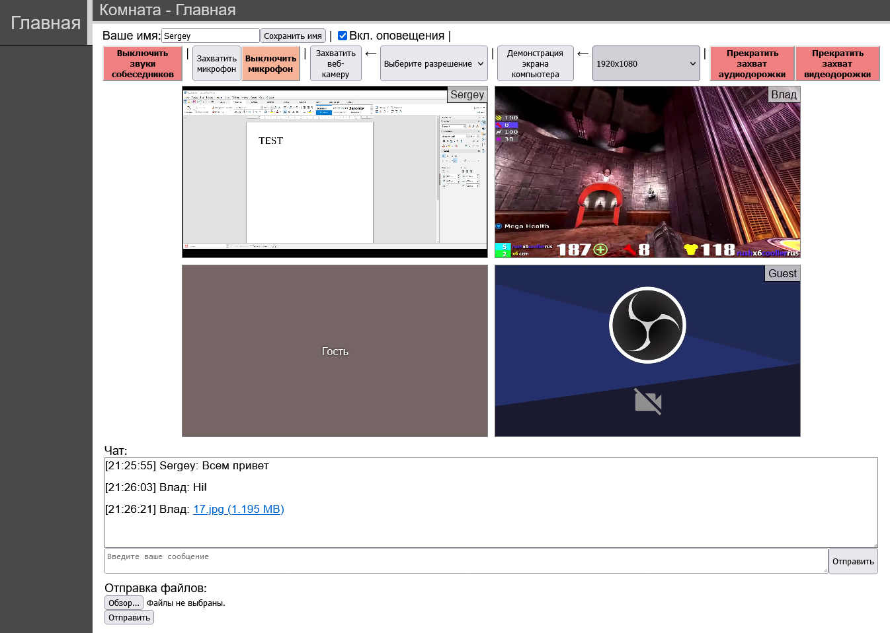

# Nostromo (English)

- [Description](#description)
    - [Short description](#short-description)
    - [Future development plans](#future-development-plans)
    - [Features](#features)
    - [Perfomance](#perfomance)
- [Setup, settings, requirements](#setup-settings-requirements)
- [FAQ](#faq)
- [Demo screenshot](#demo-screenshot-not-final-result)
- [Author](#author)
- [License](#license)

# Description

## Short description

**Nostromo** - platform for video conferencing, built on `WebRTC`. 

Absolutely free, standalone, open-source, without any artificial limits or restrictions.

**Nostromo** consists of several components:
Repository                                                     | Description
-------------                                                  | -------------
[Nostromo Server](https://gitlab.com/SgAkErRu/nostromo)        | Nostromo Server (backend), built on `Node.js`
[Nostromo Web](https://gitlab.com/SgAkErRu/nostromo-web)       | Nostromo Web-Client (frontend), written on pure `HTML` and `TypeScript`
[Nostromo Shared](https://gitlab.com/SgAkErRu/nostromo-shared) | Component with shared types and structures for backend and frontend

## Future development plans

You can read the approximate development plans [here, in Milestones](https://gitlab.com/SgAkErRu/nostromo/-/milestones).

## Features

- ♾️ Absolutely **free** without any limits or restrictions (for example, by time or number of participants).

- 🏢 Completely **standalone** - can work both in a private network without the Internet, and in a public network via the Internet.

- 🛡️ **Security** is ensured through the use of technologies that support data encryption: `DTLS-SRTP` for media streams and `HTTPS` for any text and file data.

- 💾 The system has a built-in **mechanism for saving server data** in the form of **files** format `.json`. Accordingly, no **database** is required for this app. However, database support is planned in the future as an additional option.

- 🤨 **The maximum number of participants** depends on the technical capabilites of the server (check [perfomance](#perfomance)).

- 🖥️ **Connect** using your smartphone or computer via a browser that supports `WebRTC` (recommended latest major versions of `Mozilla Firefox` or `Google Chrome`). In the near future - a desktop client for a computer. In the long-term plans - an Android application.

- 🕵️ **Guest support** - you do not need to register an account. You can just click on the link and you can already participate in the conference.

- 🔒 **Rooms** (conferences) can be protected with **password**. You can join the room by entering the password manually, but you can join by using a special link with the hash password included.

- 🎙️ You can capture **the microphone**, **webcam** and / or **computer (or window) screen** (if it's Chrome, you can also capture a tab in the browser and, if desired, you can capture the sound of the computer or tab).

- 🔥 **Unique** (or just rare) feature to **simultaneously** capture **multiple webcams** (video devices).

- 🎞️ You can select **the resolution or frame rate** of the video stream when capturing a webcam or screen (from 240p to 1440p, for some resolutions you can select 5, 30 or 60 frames per second).

- 📋 During the conference, you can write in **chat**, as well as send **files** (you can send several files at a time).

- 📎 File uploading is implemented based on the `TUS` protocol, so it **resumes** when the upload is interrupted, moreover, you can stop the upload, and then **continue it from the same place** even after a few hours.

- 📜 **Optional chat history** - you can create a room (or change the parameter of already created room) that will not save the chat history (messages) for additional privacy and security.

- 🔨 **Admin functions** - you can create, edit and delete rooms. Clear chat history, remove files of room. Also you can disable video or audio coming from a conference participant, change the user name, kick the user from the room, block the user by IP address.

- ⏸️ The captured microphone can be **paused and unpaused** without recapturing the microphone.

- 🔊 **Sound notifications** when participants enter or exit, when video stream are captured, when the sounds of the participants are turned on or off, as well as when the microphone is paused/unpaused. You can also disable these notifications.

- 🎚️ You can adjust the level of **the sound volume** of the participants, as well as pause and unpause the media streams of another user (for example to save resources).

- 📷 **Picture-in-picture** support for videos coming from users.

## Perfomance

We have tested on **40** users for several hours and in general everything went well. **All** had their microphones captured, and **15** of them also showed screens of computer or captured webcams.

All this was on an 10-year-old server and with a network bandwith (Internet) of about 15 **Mbit/s**.

Try it yourself and share your results in any way you like (via [Issues](https://gitlab.com/SgAkErRu/nostromo/-/issues) or [e-mail](mailto:sulmpx60@yandex.ru)).

# Setup, settings, requirements

[**Setup**, **settings** and **requirements** can be found here](/docs/SETUP-EN.md).

# FAQ
[You can find FAQ here](/docs/FAQ-EN.md).

# Demo screenshot (not final result)

# Author

- SgAkErRu [[GitLab](https://gitlab.com/SgAkErRu) | [GitHub](https://github.com/SgAkErRu)]

# License

[BSD 3-Clause License](/LICENSE)